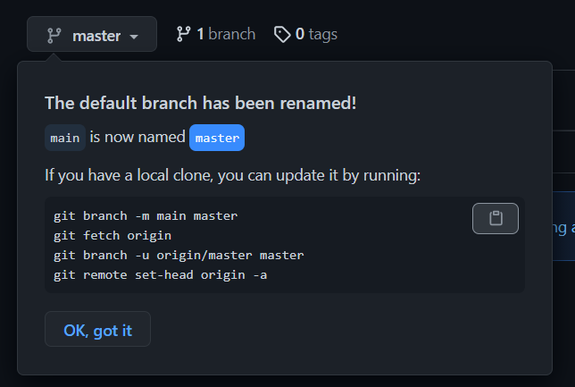

* 本仓库地址：https://github.com/fmz200/jd_scripts

###github上传本地项目

* git init //把这个目录变成Git可以管理的仓库
* git add README.md //文件添加到仓库
* git add . //不但可以跟单一文件，还可以跟通配符，更可以跟目录。一个点就把当前目录下所有未追踪的文件全部add了
* git commit -m "first commit" //把文件提交到仓库
* git remote add origin git@github.com:fmz200/jd_scripts.git //关联远程仓库
* git push -u origin master //把本地库的所有内容推送到远程库上

###分支更换名称后修改本地分支配置
* git branch -m main master
* git fetch origin
* git branch -u origin/master master
* git remote set-head origin -a

https://avatars.githubusercontent.com/u/57740735?s=60&v=4